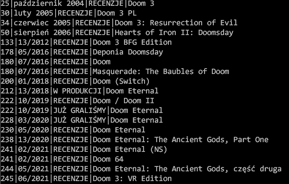

# Ficda

Jest to Baza danych gier z cdaction (obecnie numery 1-245 (nie wszystkie są na stronie))\
Do bazy w miarę możliwości będą dodawane nowe numery.\
Jeżeli masz ochotę i czas, to możesz uzupełnić kolumny i mi wysłać, albo napisać w komentarzu.\
Nazwy gier zostały zescrapowane ze strony https://www.cdaction.pl/magazyn/  

Plik bazy danych jest w formacie sqlite3, nazywa się "cdaction.db".\


# Sposób użycia (Linux Ubuntu):

* Zainstaluj sqlite3
```
$ sudo apt update
$ sudo apt install wget
$ sudo apt install sqlite3
```
* Ściągnij bazę na dysk
```
wget https://github.com/kerszl/ficda/raw/master/cdaction.db
```

# Przykład wyszukiwania gry doom
```
$ sqlite3 cdaction.db "select nr_magazine,date,section,title from magazines where title like '%doom%'"

```

