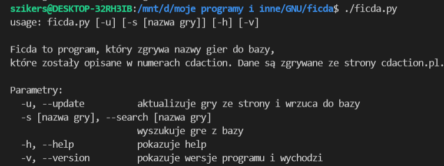
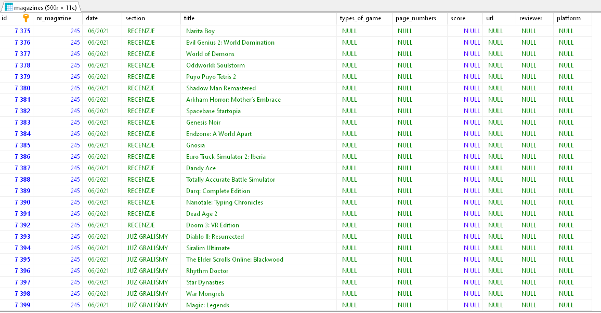
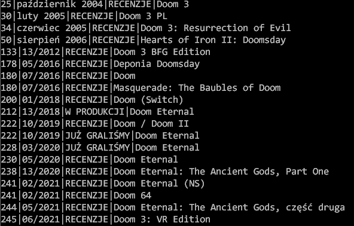

# Ficda
Jest to program, który scrapuje nazwy gier ze strony cdaction.pl  https://www.cdaction.pl/magazyn/ i wrzuca do bazy
Jeżeli masz ochotę i czas, to możesz uzupełnić kolumny i mi wysłać, albo napisać w komentarzu. 


Aby uruchomić program wystarczy użyć poniższych instrukcji

```bash
$ sudo apt install python3
$ sudo apt install python3-pip
$ git clone https://github.com/kerszl/ficda
$ cd ficda
$ pip3 install -r requirements.txt
$ chmod +x ficda.py
```


# SQLITE 3
## Jeżeli chcesz, to możesz użyć samej bazy z grami
Baza nazywa się cdaction.db. Są w niej opisane gry, które
były recenzowane w CD-Action.
Do bazy w miarę możliwości będą dodawane nowe tytuły gier.

Plik bazy danych jest w formacie sqlite3, nazywa się "cdaction.db"



## Sposób użycia (Linux Ubuntu):

* Zainstaluj sqlite3
```
$ sudo apt update
$ sudo apt install wget
$ sudo apt install sqlite3
```
* Ściągnij bazę na dysk
```
wget https://github.com/kerszl/ficda/raw/master/cdaction.db
```

## Przykład wyszukiwania gry doom
```
$ sqlite3 cdaction.db "select nr_magazine,date,section,title from magazines where title like '%doom%'"

```

